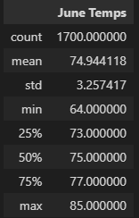
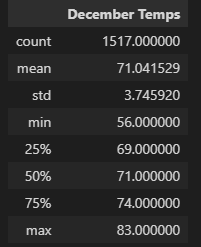

# Surfs_Up

## Overview
After discovering our love for surfing, we have decided to plan a move to Hawaii with a prospect of opening up a Surf and Shake shop. Surf 'n Shake will serve surfboards and ice cream to locals, tourists, and residents. Our investor, W. Avy, has one concern about our plan to open. This concern involves the weather forecast, as another shop was previously shut down due to inclement weather. Using our analysis skills, we are investigating the weather for the area using a weather data set. 

## Results
Our results showed multiple differences between the weather in June versus December. 
- June's average temperature was almost five degrees higher than December's average temperature. 
- June's lowest temperature was eight degrees higher than December's, and June's highest temperature was two degrees higher than December's. 
- June has a lower standard deviation in temperature than December, meaning that the temperature is more consistent. 
- More than 75% of days have a temperature higher than 77 degrees in June, while the same number of days have a temperature higher than 74 degrees in December. 

June Temperatures             |  December Temperatures
:----------------------------:|:-------------------------:
  |  

## Summary
Given our analysis, Surf 'n Shake will not suffer customer loss from temperature during either June or December. Both months have medium-high temperatures almost all throughout. Working in tandem with our precipitation analysis, we can discover exactly when to prioritize open business hours. 

With this, there are two more queries we could analyze. If we had the data, a query on wave height would be beneficial to advertize when the waves would be the best for surfing for all types of experience level. In addition, wind speed would be beneficial as well because higher wind speeds may make it more difficult for surfers to catch gnarly waves. 
